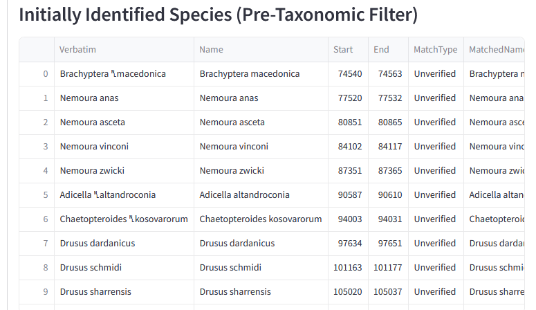
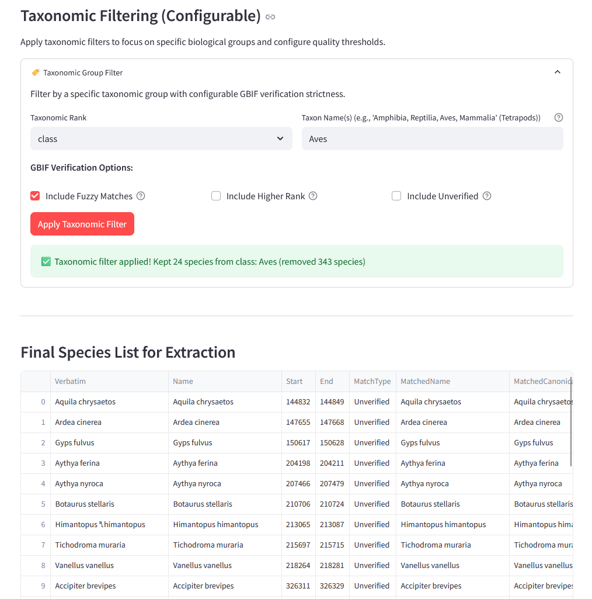

# 3. Species Discovery (Tab 2)

Once text is extracted, the next step is to find potential species names within that text.

## 3.1 GNFinder Service
EcoParse uses **GNFinder** (Global Names Finder) running in a Docker container to locate scientific names. 

*   **Process**: The extracted text from Tab 1 is sent to the GNFinder service.
*   **Filtering Strategy**: Our filtering is purposefully lenient.
    *   **Goal**: It is better to have "false positives" (words identified as species that aren't) than to miss an actual species due to strict filtering.
    *   **Result**: You may see non-species terms in the list, which will be filtered out in the next step.

## 3.2 Taxonomic Filtering
To clean up the list of potential names, we use the GBIF (Global Biodiversity Information Facility) API.

1.  **Input Rank and Name**: Enter the taxonomic rank and name of the group you wish to filter for (e.g., *Class:* *Mammalia* or *Kingdom:* *Plantae*).
2.  **Filter**: The app sends the candidate list to GBIF, retaining only those that belong to the specified group.
3.  **Check Output**: Review the filtered list of species before proceeding.

