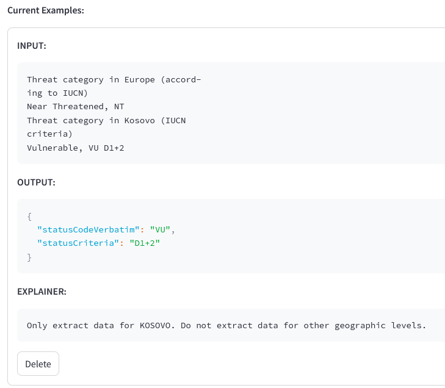

# 4. Extraction Configuration (Tab 3)

This tab controls *what* data is extracted and *how* the AI understands the document structure.

## 4.1 Configuration
For most standard Redlist use cases, the extraction fields are pre-defined (e.g., Threat Code, Criteria).

> **Custom Data**: If you need to extract different fields, you can modify the `config.yml` file which defines the data schema. If running EcoParse from Docker, make sure to rebuild the docker image after modifying the config file.

## 4.2 Few-Shot Examples (Crucial Step)
To ensure high accuracy, especially for documents in different languages or with unique layouts, you should provide **Few-Shot Examples**.

*   **What are they?**: Real examples from the document you are working on, showing the AI exactly what to look for.
*   **How many?**: Usually, **1-3 examples** are sufficient.
*   **Format**: Paste a sentence or paragraph from the text, and manually specify the expected extraction result. Provide reasoning if needed. For example, if 2 assessments are present, specify we want the national level, not the global level. If assessments from multiple years are present, specify which year we are extracting data for.

> **Tip**: Supplying examples significantly improves results by "teaching" the AI the specific pattern of your document.

