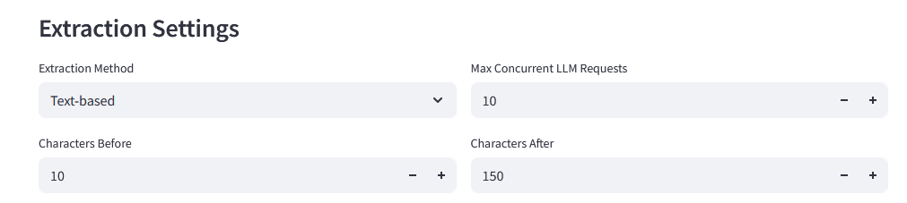
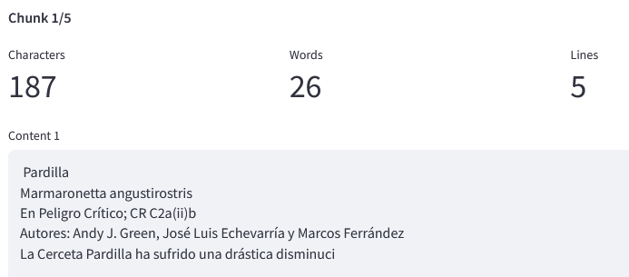
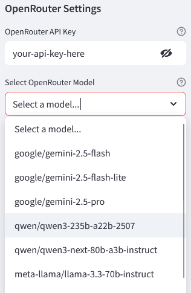

# 5. Chunking and Extraction (Tab 4)

The final step is to configure how the text is fed to the AI and run the extraction.

## 5.1 Chunking Strategy
"Chunking" determines how much context surrounds each species name when identifying data.

*   **Text Chunks**: 
    *   **Pros**: Cheaper and faster processing.
    *   **Cons**: Loses visual layout information.
*   **Image Chunks**: 
    *   **Pros**: Preserves page structure (layout, tables), often more accurate for complex documents.
    *   **Cons**: More expensive (higher token usage) and slower.

## 5.2 Configuring Chunking
Adjust the settings to ensure the relevant info is captured.

1.  **Input Length**: Set the number of characters/tokens to include **before** and **after** the species mention.
2.  **Preview**: Click the **Preview Chunk** button.
    *   **Goal**: Adjust the length until you see both the species name *and* the target data (e.g., threat code) in the preview window. The rule should cover all species cases safely.

> **Tip**: The chunk preview above looks good. The species name is visible and the target data is also visible. This is not the case for all documents. Sometimes the information is spread across multiple lines or columns. In those cases, **image mode** is a better choice. If you are using image chunks, make sure to select a model that supports image input.

## 5.3 Service and Model Selection
Select the AI provider and model to perform the extraction.

*   **Service**: Choose between Gemini, OpenRouter, or Ollama.
*   **API Key**: Input your API key if required for the selected service.

### Recommended Models
*   **Gemini**: `Gemini 2.5 flash-lite` or `Gemini 3 Flash` (Good balance of speed/quality).
*   **OpenRouter / Ollama**: `Qwen Instruct` is currently the best performing choice for text tasks. Gemini flash-lite works well for image based extraction. 
*   **Model selection**: You can input your own model name if you believe it is better suited for the task. Current model selection is based on internal benchmarks, but might not account for certain languages or future developments. Model name must be in the correct format as listed on the service's website. 

